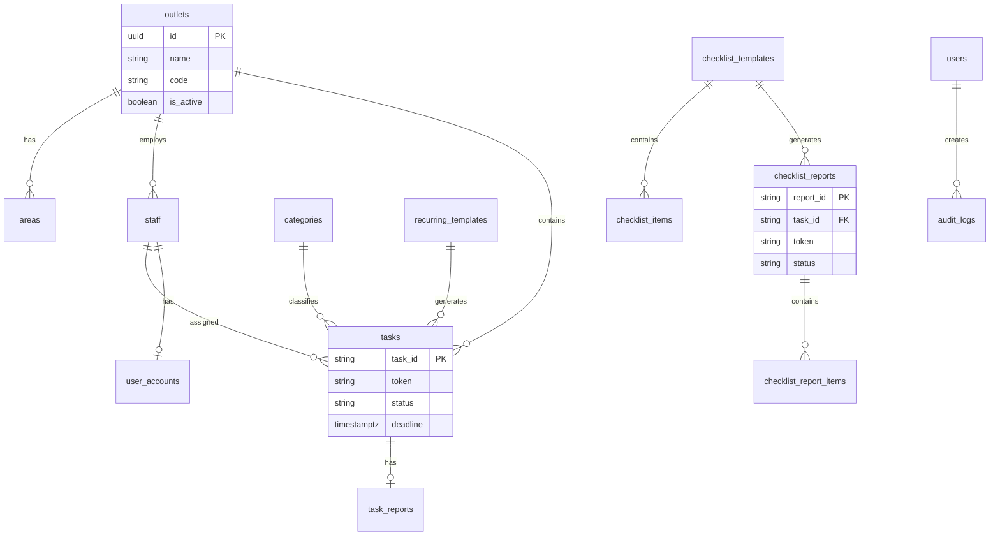

# Database Schema v2 (PostgreSQL)

Desain schema PostgreSQL berdasarkan struktur Google Sheets v1 dan tipe di `lib/types.ts`.

**ORM disarankan:** Prisma  
**Provider disarankan:** Supabase (PostgreSQL + Auth + Storage)

---

## Diagram Relasi



---

## Tabel: `outlets`

Menggantikan enum hardcoded di v1.

```sql
CREATE TABLE outlets (
  id          UUID PRIMARY KEY DEFAULT gen_random_uuid(),
  code        VARCHAR(50) NOT NULL UNIQUE,  -- 'KBU', 'KISAMEN', 'SAMTARO'
  name        VARCHAR(100) NOT NULL,         -- 'Kopi Buri Umah'
  is_active   BOOLEAN NOT NULL DEFAULT TRUE,
  created_at  TIMESTAMPTZ NOT NULL DEFAULT NOW(),
  updated_at  TIMESTAMPTZ NOT NULL DEFAULT NOW()
);

-- Seed data
INSERT INTO outlets (code, name) VALUES
  ('KBU', 'Kopi Buri Umah'),
  ('KISAMEN', 'Kisamen'),
  ('SAMTARO', 'Samtaro Express');
```

---

## Tabel: `areas`

Menggantikan sheet AREAS.

```sql
CREATE TABLE areas (
  id          UUID PRIMARY KEY DEFAULT gen_random_uuid(),
  outlet_id   UUID REFERENCES outlets(id),
  name        VARCHAR(100) NOT NULL,
  is_active   BOOLEAN NOT NULL DEFAULT TRUE,
  created_at  TIMESTAMPTZ NOT NULL DEFAULT NOW(),
  updated_at  TIMESTAMPTZ NOT NULL DEFAULT NOW(),
  UNIQUE(outlet_id, name)
);
```

**Mapping dari v1:** `Dapur`, `Bar`, `Floor`, `Gudang`, `Toilet`, `Outdoor`, `Maintenance`, `Kebon`, `Kasir`

---

## Tabel: `categories`

Menggantikan sheet CATEGORIES.

```sql
CREATE TABLE categories (
  id          UUID PRIMARY KEY DEFAULT gen_random_uuid(),
  name        VARCHAR(100) NOT NULL UNIQUE,
  is_active   BOOLEAN NOT NULL DEFAULT TRUE,
  created_at  TIMESTAMPTZ NOT NULL DEFAULT NOW(),
  updated_at  TIMESTAMPTZ NOT NULL DEFAULT NOW()
);
```

**Mapping dari v1:** `Cleaning`, `Maintenance`, `Stock`, `Kitchen`, `Bar`, `Floor`, `Waste`, `General`

---

## Tabel: `staff`

Menggantikan sheet STAFF.

```sql
CREATE TYPE staff_role AS ENUM ('STAFF', 'LEADER', 'ADMIN');
CREATE TYPE staff_status AS ENUM ('ACTIVE', 'INACTIVE');

CREATE TABLE staff (
  id            UUID PRIMARY KEY DEFAULT gen_random_uuid(),
  staff_id      VARCHAR(50) NOT NULL UNIQUE,  -- format: STF-YYYYMMDD-XXX (pertahankan dari v1)
  name          VARCHAR(200) NOT NULL,
  position      VARCHAR(100),
  outlet_id     UUID NOT NULL REFERENCES outlets(id),
  area_id       UUID REFERENCES areas(id),
  wa_number     VARCHAR(20) NOT NULL,
  role          staff_role NOT NULL DEFAULT 'STAFF',
  status        staff_status NOT NULL DEFAULT 'ACTIVE',
  login_enabled BOOLEAN NOT NULL DEFAULT FALSE,
  created_at    TIMESTAMPTZ NOT NULL DEFAULT NOW(),
  updated_at    TIMESTAMPTZ NOT NULL DEFAULT NOW()
);

CREATE INDEX idx_staff_outlet ON staff(outlet_id);
CREATE INDEX idx_staff_status ON staff(status);
CREATE INDEX idx_staff_wa ON staff(wa_number);
```

---

## Tabel: `user_accounts`

Menggantikan sheet USERS + auth v1.

```sql
CREATE TABLE user_accounts (
  id            UUID PRIMARY KEY DEFAULT gen_random_uuid(),
  user_id       VARCHAR(50) NOT NULL UNIQUE,  -- format: USR-YYYYMMDD-XXX
  staff_id      VARCHAR(50) REFERENCES staff(staff_id),
  username      VARCHAR(100) NOT NULL UNIQUE,
  password_hash VARCHAR(255) NOT NULL,        -- bcrypt
  role          staff_role NOT NULL,
  login_enabled BOOLEAN NOT NULL DEFAULT TRUE,
  last_login    TIMESTAMPTZ,
  created_at    TIMESTAMPTZ NOT NULL DEFAULT NOW(),
  updated_at    TIMESTAMPTZ NOT NULL DEFAULT NOW()
);
```

---

## Tabel: `tasks`

Tabel utama — menggantikan sheet TASK.

```sql
CREATE TYPE task_status AS ENUM (
  'CREATED', 'SENT', 'WA_FAILED', 'OPEN', 'OPENED',
  'SUBMITTED', 'RESUBMITTED', 'WAITING_VERIFICATION',
  'DONE', 'VERIFIED', 'REVISI', 'REVISION', 'REVISION_REQUESTED', 'LATE'
);

CREATE TYPE task_priority AS ENUM ('Low', 'Medium', 'High', 'Urgent');

CREATE TABLE tasks (
  id                  UUID PRIMARY KEY DEFAULT gen_random_uuid(),
  task_id             VARCHAR(50) NOT NULL UNIQUE,  -- TASK-YYYYMMDD-XXX
  token               VARCHAR(64) NOT NULL,          -- 32 char random
  created_by          VARCHAR(200),
  outlet_id           UUID NOT NULL REFERENCES outlets(id),
  area_id             UUID REFERENCES areas(id),
  category_id         UUID REFERENCES categories(id),
  -- Denormalized untuk query cepat (sync dari relasi)
  outlet_name         VARCHAR(100),
  area_name           VARCHAR(100),
  category_name       VARCHAR(100),
  task_title          VARCHAR(500) NOT NULL,
  task_description    TEXT,
  priority            task_priority NOT NULL DEFAULT 'Medium',
  pic_name            VARCHAR(200) NOT NULL,
  pic_wa              VARCHAR(20) NOT NULL,
  staff_id            VARCHAR(50) REFERENCES staff(staff_id),
  deadline            TIMESTAMPTZ NOT NULL,
  before_photo_url    TEXT,
  status              task_status NOT NULL DEFAULT 'CREATED',
  report_link         TEXT,
  wa_sent_at          TIMESTAMPTZ,
  opened_at           TIMESTAMPTZ,
  submitted_at        TIMESTAMPTZ,
  after_photo_url     TEXT,
  staff_note          TEXT,
  leader_verification TEXT,
  verified_by         VARCHAR(200),
  verified_at         TIMESTAMPTZ,
  final_status        VARCHAR(50),
  is_late             BOOLEAN NOT NULL DEFAULT FALSE,
  duration_minutes    INTEGER,
  checklist_mode      BOOLEAN NOT NULL DEFAULT FALSE,  -- v1: "YES"/empty → v2: boolean
  recurring_template_id VARCHAR(50),
  source_version      VARCHAR(10) NOT NULL DEFAULT 'v2',  -- 'v1' untuk data migrasi, 'v2' untuk baru
  gas_synced_at       TIMESTAMPTZ,  -- terakhir sync ke/dari GAS
  created_at          TIMESTAMPTZ NOT NULL DEFAULT NOW(),
  updated_at          TIMESTAMPTZ NOT NULL DEFAULT NOW()
);

CREATE INDEX idx_tasks_status ON tasks(status);
CREATE INDEX idx_tasks_deadline ON tasks(deadline);
CREATE INDEX idx_tasks_outlet ON tasks(outlet_id);
CREATE INDEX idx_tasks_token ON tasks(task_id, token);
CREATE INDEX idx_tasks_pic ON tasks(pic_wa);
CREATE INDEX idx_tasks_created ON tasks(created_at DESC);
```

---

## Tabel: `recurring_templates`

Menggantikan sheet RECURRING_TEMPLATE.

```sql
CREATE TYPE repeat_type AS ENUM ('daily', 'weekdays', 'weekly', 'monthly', 'custom');

CREATE TABLE recurring_templates (
  id                UUID PRIMARY KEY DEFAULT gen_random_uuid(),
  template_id       VARCHAR(50) NOT NULL UNIQUE,  -- REC-YYYYMMDD-XXX
  template_name     VARCHAR(200) NOT NULL,
  outlet_id         UUID NOT NULL REFERENCES outlets(id),
  area_id           UUID REFERENCES areas(id),
  category_id       UUID REFERENCES categories(id),
  pic_name          VARCHAR(200) NOT NULL,
  pic_wa            VARCHAR(20) NOT NULL,
  staff_id          VARCHAR(50) REFERENCES staff(staff_id),
  task_title        VARCHAR(500) NOT NULL,
  task_description  TEXT,
  repeat_type       repeat_type NOT NULL DEFAULT 'daily',
  repeat_days       TEXT[],  -- ['senin','rabu','jumat']
  repeat_time       TIME NOT NULL,       -- HH:mm
  deadline_time     TIME NOT NULL,       -- HH:mm
  requires_photo    BOOLEAN NOT NULL DEFAULT TRUE,
  active_status     BOOLEAN NOT NULL DEFAULT TRUE,
  template_version  INTEGER NOT NULL DEFAULT 1,
  created_at        TIMESTAMPTZ NOT NULL DEFAULT NOW(),
  updated_at        TIMESTAMPTZ NOT NULL DEFAULT NOW()
);
```

---

## Tabel: `checklist_templates`

Menggantikan sheet CHECKLIST_TEMPLATE.

```sql
CREATE TABLE checklist_templates (
  id              UUID PRIMARY KEY DEFAULT gen_random_uuid(),
  template_id     VARCHAR(50) NOT NULL UNIQUE,  -- CHKM-YYYYMMDD-XXX
  template_name   VARCHAR(200) NOT NULL,
  outlet_id       UUID NOT NULL REFERENCES outlets(id),
  area_id         UUID REFERENCES areas(id),
  task_title      VARCHAR(500),
  checklist_title VARCHAR(500) NOT NULL,
  pic_name        VARCHAR(200),
  pic_wa          VARCHAR(20),
  requires_photo  BOOLEAN NOT NULL DEFAULT FALSE,
  active_status   BOOLEAN NOT NULL DEFAULT TRUE,
  created_at      TIMESTAMPTZ NOT NULL DEFAULT NOW(),
  updated_at      TIMESTAMPTZ NOT NULL DEFAULT NOW()
);
```

---

## Tabel: `checklist_items`

Menggantikan sheet CHECKLIST_ITEM.

```sql
CREATE TABLE checklist_items (
  id                  UUID PRIMARY KEY DEFAULT gen_random_uuid(),
  checklist_item_id   VARCHAR(50) NOT NULL UNIQUE,  -- CHKI-YYYYMMDD-XXX
  template_id         VARCHAR(50) NOT NULL REFERENCES checklist_templates(template_id),
  item_order          INTEGER NOT NULL,
  item_text           TEXT NOT NULL,
  requires_photo      BOOLEAN NOT NULL DEFAULT FALSE,
  is_required         BOOLEAN NOT NULL DEFAULT TRUE,
  active_status       BOOLEAN NOT NULL DEFAULT TRUE,
  created_at          TIMESTAMPTZ NOT NULL DEFAULT NOW(),
  updated_at          TIMESTAMPTZ NOT NULL DEFAULT NOW(),
  UNIQUE(template_id, item_order)
);
```

---

## Tabel: `checklist_reports`

Menggantikan sheet CHECKLIST_REPORT.

```sql
CREATE TYPE checklist_report_status AS ENUM ('OPEN', 'SUBMITTED', 'DONE', 'REVISI', 'LATE');

CREATE TABLE checklist_reports (
  id              UUID PRIMARY KEY DEFAULT gen_random_uuid(),
  report_id       VARCHAR(50) NOT NULL UNIQUE,  -- CHK-TSK-YYYYMMDD-XXX
  task_id         VARCHAR(50) REFERENCES tasks(task_id),
  template_id     VARCHAR(50) NOT NULL REFERENCES checklist_templates(template_id),
  token           VARCHAR(64) NOT NULL,
  pic_name        VARCHAR(200) NOT NULL,
  pic_wa          VARCHAR(20) NOT NULL,
  outlet_id       UUID REFERENCES outlets(id),
  area_id         UUID REFERENCES areas(id),
  report_date     DATE NOT NULL,
  deadline        TIMESTAMPTZ NOT NULL,
  checklist_title VARCHAR(500),
  status          checklist_report_status NOT NULL DEFAULT 'OPEN',
  submitted_at    TIMESTAMPTZ,
  staff_note      TEXT,
  after_photo_url TEXT,
  verified_by     VARCHAR(200),
  verified_at     TIMESTAMPTZ,
  revision_note   TEXT,
  revision_count  INTEGER NOT NULL DEFAULT 0,
  is_late         BOOLEAN NOT NULL DEFAULT FALSE,
  source_version  VARCHAR(10) NOT NULL DEFAULT 'v2',
  created_at      TIMESTAMPTZ NOT NULL DEFAULT NOW(),
  updated_at      TIMESTAMPTZ NOT NULL DEFAULT NOW()
);

CREATE INDEX idx_checklist_reports_token ON checklist_reports(task_id, token);
CREATE INDEX idx_checklist_reports_status ON checklist_reports(status);
```

---

## Tabel: `checklist_report_items`

Menggantikan sheet CHECKLIST_REPORT_ITEM.

```sql
CREATE TABLE checklist_report_items (
  id                  UUID PRIMARY KEY DEFAULT gen_random_uuid(),
  report_item_id      VARCHAR(50) NOT NULL UNIQUE,  -- CHKRI-YYYYMMDD-XXX
  report_id           VARCHAR(50) NOT NULL REFERENCES checklist_reports(report_id),
  checklist_item_id   VARCHAR(50) NOT NULL REFERENCES checklist_items(checklist_item_id),
  is_checked          BOOLEAN NOT NULL DEFAULT FALSE,
  photo_url           TEXT,
  checked_at          TIMESTAMPTZ,
  created_at          TIMESTAMPTZ NOT NULL DEFAULT NOW(),
  updated_at          TIMESTAMPTZ NOT NULL DEFAULT NOW(),
  UNIQUE(report_id, checklist_item_id)
);
```

---

## Tabel: `audit_logs` (Baru di v2)

Tidak ada di v1 — ditambahkan untuk traceability.

```sql
CREATE TABLE audit_logs (
  id          UUID PRIMARY KEY DEFAULT gen_random_uuid(),
  entity_type VARCHAR(50) NOT NULL,   -- 'task', 'checklist_report', 'staff', dll.
  entity_id   VARCHAR(50) NOT NULL,
  action      VARCHAR(100) NOT NULL,  -- 'created', 'submitted', 'verified', 'revision_requested'
  actor_type  VARCHAR(20) NOT NULL,   -- 'leader', 'staff', 'system', 'cron'
  actor_id    VARCHAR(100),
  actor_name  VARCHAR(200),
  old_value   JSONB,
  new_value   JSONB,
  metadata    JSONB,
  ip_address  INET,
  user_agent  TEXT,
  created_at  TIMESTAMPTZ NOT NULL DEFAULT NOW()
);

CREATE INDEX idx_audit_entity ON audit_logs(entity_type, entity_id);
CREATE INDEX idx_audit_created ON audit_logs(created_at DESC);
```

---

## Tabel: `sync_logs` (Untuk Dual-Write)

Track operasi sync antara v1 (GAS) dan v2 (PostgreSQL).

```sql
CREATE TYPE sync_status AS ENUM ('success', 'partial', 'failed');

CREATE TABLE sync_logs (
  id            UUID PRIMARY KEY DEFAULT gen_random_uuid(),
  operation     VARCHAR(100) NOT NULL,  -- 'create_task', 'submit_report', 'sync_import'
  entity_type   VARCHAR(50) NOT NULL,
  entity_id     VARCHAR(50),
  v1_status     sync_status,
  v2_status     sync_status,
  v1_response   JSONB,
  v2_response   JSONB,
  error_message TEXT,
  created_at    TIMESTAMPTZ NOT NULL DEFAULT NOW()
);

CREATE INDEX idx_sync_logs_entity ON sync_logs(entity_type, entity_id);
CREATE INDEX idx_sync_logs_failed ON sync_logs(created_at DESC) WHERE v1_status = 'failed' OR v2_status = 'failed';
```

---

## Mapping Field v1 → v2

### Normalisasi yang Perlu Diperhatikan

| Field v1 | Nilai v1 | Nilai v2 |
|----------|----------|----------|
| `checklist_mode` | `"YES"` / kosong | `true` / `false` |
| `is_late` | `"YES"` / `"NO"` / boolean | `boolean` |
| `is_active` / `active_status` | `"TRUE"` / `"ACTIVE"` | `boolean` |
| `repeat_type` | `"DAILY"` (uppercase) | `"daily"` (lowercase enum) |
| `staff_name` | field di GAS | `name` di tabel staff |
| `last_updated` | timestamp GAS | `updated_at` |
| `before_photo_url` | Google Drive URL | Cloud storage URL |

### ID Format (Pertahankan)

| Entity | Format | Contoh |
|--------|--------|--------|
| Task | `TASK-YYYYMMDD-XXX` | `TASK-20260616-0003` |
| Staff | `STF-YYYYMMDD-XXX` | `STF-20260101-001` |
| Recurring | `REC-YYYYMMDD-XXX` | `REC-20260101-001` |
| Checklist Template | `CHKM-YYYYMMDD-XXX` | `CHKM-20260101-001` |
| Checklist Item | `CHKI-YYYYMMDD-XXX` | `CHKI-20260101-001` |
| Checklist Report | `CHK-TSK-YYYYMMDD-XXX` | `CHK-TSK-20260616-001` |
| Token | 32 char alphanumeric | random |

---

## Script Migrasi Data (Konsep)

```typescript
// scripts/migrate-from-sheets.ts
async function migrateTasks(sheetRows: Record<string, string>[]) {
  for (const row of sheetRows) {
    await db.task.upsert({
      where: { task_id: row.task_id },
      create: {
        task_id: row.task_id,
        token: row.token,
        task_title: row.task_title,
        status: normalizeStatus(row.status),
        is_late: row.is_late === 'YES' || row.is_late === 'TRUE',
        checklist_mode: row.checklist_mode === 'YES',
        source_version: 'v1',
        // ... map semua field
      },
      update: { /* same fields */ },
    });
  }
}
```

---

## Index & Performance

| Query Pattern | Index |
|---------------|-------|
| Dashboard filter by date + outlet | `idx_tasks_deadline`, `idx_tasks_outlet` |
| Staff buka link by token | `idx_tasks_token` (composite) |
| Cari staff by WA | `idx_staff_wa` |
| Audit trail per entity | `idx_audit_entity` |
| Monitor sync failures | `idx_sync_logs_failed` (partial) |

**Target:** Dashboard load < 500ms untuk 1000 tasks.

---

## Backup & Retention

| Data | Retention | Backup |
|------|-----------|--------|
| Tasks aktif | Selamanya | Daily snapshot |
| Tasks selesai > 1 tahun | Arsip (cold storage) | Monthly |
| Audit logs | 2 tahun | Weekly |
| Sync logs | 90 hari | Tidak perlu arsip |
| Foto | Selamanya | Replicate ke secondary bucket |
