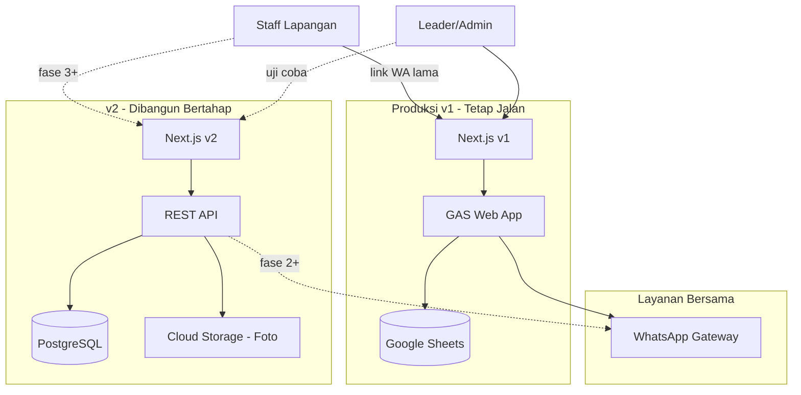
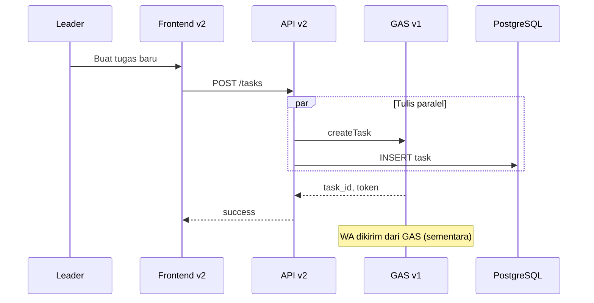

# Strategi Migrasi v1 → v2

## Ringkasan Eksekutif

Nusa Food Task System v1 masih dipakai operasional setiap hari. Versi 2 dibangun **parallel** dengan v1 menggunakan pola **Strangler Fig**: fitur demi fitur dipindah ke v2, sementara v1 tetap melayani traffic produksi sampai v2 lolos uji coba.

**Tujuan v2:**
- Ganti Google Sheets + GAS dengan database dan API yang proper
- Perbaiki reliability (kurangi error format GAS, mock fallback)
- Siapkan fondasi untuk fitur baru (audit log, analytics, multi-outlet scale)
- Pertahankan UX dan URL yang sudah dikenal staff

**Yang TIDAK berubah di v2:**
- URL halaman staff: `/report/[taskId]?token=...` dan `/checklist/[taskId]?token=...`
- Format `task_id`: `TASK-YYYYMMDD-XXX`
- Alur status tugas yang dipahami leader
- Flow WhatsApp → link → upload foto → verifikasi

---

## Arsitektur Target



---

## Masalah v1 yang Memicu v2

| # | Masalah | Dampak Operasional | Solusi v2 |
|---|---------|-------------------|-----------|
| 1 | Google Sheets sebagai DB | Lambat, limit row, race condition | PostgreSQL + Prisma |
| 2 | GAS 27+ action, format response tidak konsisten | Bug intermittent, mock fallback aktif | REST API dengan schema response tetap |
| 3 | Foto base64 via API body | Limit 4.5MB Vercel, lambat di HP | Upload langsung ke cloud storage |
| 4 | `lib/api.ts` 1300+ baris monolitik | Sulit maintain dan test | Service layer per domain |
| 5 | Auth sederhana (admin password) | Tidak scalable multi-user | Supabase Auth / proper RBAC |
| 6 | Tidak ada audit trail | Sulit investigasi masalah | Tabel `audit_logs` |
| 7 | Dual source of truth (GAS + mock) | Data tidak konsisten di dev/staging | Single source of truth di DB |

---

## Fase Migrasi

### Fase 0 — Persiapan (Risiko: Nol)

**Tujuan:** Siapkan fondasi tanpa menyentuh produksi.

| # | Task | Output |
|---|------|--------|
| 0.1 | Freeze fitur besar di v1 (hanya bugfix kritis) | Branch policy |
| 0.2 | Buat repo `nusafood-v2` atau branch `v2` terpisah | Repo baru |
| 0.3 | Setup staging: `v2.nusafood.app` | Environment staging |
| 0.4 | Setup PostgreSQL (Supabase recommended) | Database kosong |
| 0.5 | Dokumentasikan semua GAS action yang aktif dipakai | Lihat `GAS_ALIGNMENT_AUDIT.md` |
| 0.6 | Export snapshot Google Sheets sebagai backup | File CSV/JSON arsip |
| 0.7 | Setup monitoring dasar (Sentry, uptime check) | Alert channel |

**Kriteria selesai:** Staging v2 bisa di-deploy, DB kosong siap, v1 tidak terganggu.

---

### Fase 1 — Read-Only Sync (Risiko: Rendah)

**Tujuan:** v2 bisa **baca** data nyata dari v1 tanpa menulis ke produksi.

```
Google Sheets ──sync tiap 1 jam──▶ PostgreSQL v2
                                        ▲
Frontend v2 (staging) ──────────────────┘ read only
```

| # | Task | Detail |
|---|------|--------|
| 1.1 | Buat sync script (Node.js / GAS cron) | Baca semua sheet → upsert ke PostgreSQL |
| 1.2 | Implement `GET /tasks`, `GET /tasks/:id` | Dashboard v2 tampilkan data nyata |
| 1.3 | Implement `GET /staff`, `GET /areas`, `GET /categories` | Master data |
| 1.4 | Bandingkan count v1 vs v2 | Harus match 100% sebelum lanjut |
| 1.5 | Uji dashboard v2 internal | Leader review data di staging |

**Kriteria selesai:** Dashboard v2 menampilkan data identik dengan v1.

---

### Fase 2 — Dual Write (Risiko: Sedang)

**Tujuan:** Tugas baru ditulis ke **GAS (v1) DAN PostgreSQL (v2)** secara paralel.



| # | Task | Detail |
|---|------|--------|
| 2.1 | Implement `POST /tasks` dengan dual-write | GAS dulu, lalu DB; rollback DB jika GAS gagal |
| 2.2 | Log setiap dual-write ke `sync_logs` | Track success/failure per operasi |
| 2.3 | Alert jika dual-write gagal sebagian | Slack/WA ke admin tech |
| 2.4 | Uji buat tugas dari v2 staging | Verifikasi muncul di v1 DAN v2 |
| 2.5 | Link WA tetap dari GAS → URL v1 | Belum pindah di fase ini |

**Kriteria selesai:** 50+ tugas dibuat via v2, 0 mismatch antara GAS dan DB.

---

### Fase 3 — Halaman Staff + Adapter (Risiko: Sedang-Tinggi)

**Tujuan:** Staff bisa submit laporan via v2, dengan fallback ke v1 untuk tugas lama.

Ini fase **paling kritis** karena staff tidak bisa login ulang jika link mati.

**Adapter pattern:**

```typescript
async function getTaskByToken(taskId: string, token: string): Promise<Task | null> {
  // 1. Coba database v2
  const task = await db.task.findFirst({
    where: { task_id: taskId, token },
  });
  if (task) return task;

  // 2. Fallback ke GAS v1 untuk tugas historis
  const gasResult = await gasV1.getTaskByToken(taskId, token);
  if (gasResult.success) return gasResult.data;

  return null;
}
```

| # | Task | Detail |
|---|------|--------|
| 3.1 | Deploy `/report/[taskId]` di v2 dengan adapter | URL sama, backend hybrid |
| 3.2 | Deploy `/checklist/[taskId]` di v2 dengan adapter | Sama |
| 3.3 | Upload foto ke cloud storage (bukan base64) | Cloudinary / Supabase Storage |
| 3.4 | `POST /tasks/:id/submit` dual-write | Tulis ke GAS + DB |
| 3.5 | Uji dengan HP staff nyata | Minimal 20 submit berhasil |
| 3.6 | Uji link WA lama (tugas v1) | Harus tetap buka dan submit |
| 3.7 | Uji link WA baru (tugas dual-write) | Harus buka di v2 |

**Kriteria selesai:** 2 minggu operasional tanpa insiden submit staff.

---

### Fase 4 — Cutover Leader Dashboard (Risiko: Terkendali)

**Tujuan:** Leader pakai v2 sebagai default, v1 standby.

| # | Task | Detail |
|---|------|--------|
| 4.1 | Redirect domain utama ke v2 | DNS / Vercel project switch |
| 4.2 | Link WA baru mengarah ke domain v2 | Update `buildReportLink()` |
| 4.3 | Matikan create task di v1 | v1 read-only |
| 4.4 | Monitor 1 minggu penuh | Daily check error rate |
| 4.5 | Training singkat leader | Perubahan UI minimal, fokus pada yang baru |

**Kriteria selesai:** Semua leader pakai v2, error rate < 1%.

---

### Fase 5 — Decommission v1 (Risiko: Rendah jika fase 4 stabil)

| # | Task | Detail |
|---|------|--------|
| 5.1 | Matikan dual-write ke GAS | Hanya tulis ke PostgreSQL |
| 5.2 | Migrasi data historis yang belum ada di v2 | One-time backfill |
| 5.3 | GAS + Sheets jadi read-only arsip | Jangan hapus 2 bulan |
| 5.4 | Arsipkan deploy v1 di Vercel | Keep rollback capability |
| 5.5 | Update dokumentasi operasional | SOP baru untuk leader |

---

## Kontrak URL yang Wajib Dipertahankan

| URL | Akses | Auth | Catatan |
|-----|-------|------|---------|
| `/` | Publik | Tidak | Landing page |
| `/login` | Publik | Tidak | Leader login |
| `/dashboard` | Admin | Session JWT | Dashboard utama |
| `/tasks/new` | Admin | Session JWT | Buat tugas |
| `/tasks/[taskId]` | Admin | Session JWT | Detail & verifikasi |
| `/report/[taskId]?token=xxx` | **Publik** | Token di URL | **KRITIS — jangan ubah** |
| `/checklist/[taskId]?token=xxx` | **Publik** | Token di URL | **KRITIS — jangan ubah** |
| `/recurring` | Admin | Session JWT | Template berulang |
| `/settings/*` | Admin | Session JWT | Master data |

---

## Mapping Status Tugas (v1 → v2)

Status di v1 punya banyak alias. v2 harus normalisasi ke enum tunggal:

| Grup UI | Status v1 (raw) | Status v2 (normalized) |
|---------|-----------------|------------------------|
| Belum dikerjakan | CREATED, SENT, WA_FAILED, OPEN, OPENED | `OPEN` |
| Terkirim | SUBMITTED, RESUBMITTED, WAITING_VERIFICATION | `SUBMITTED` |
| Selesai | DONE, VERIFIED | `DONE` |
| Revisi | REVISI, REVISION, REVISION_REQUESTED | `REVISI` |
| Terlambat | LATE (+ flag `is_late`) | `LATE` |

---

## Checklist Keputusan Sebelum Mulai

- [ ] Pilih provider database (disarankan: Supabase)
- [ ] Pilih provider storage foto (disarankan: Supabase Storage atau Cloudinary)
- [ ] Tentukan outlet pilot (disarankan: KBU dulu)
- [ ] Tentukan domain staging
- [ ] Tentukan siapa owner migrasi (tech lead)
- [ ] Tentukan channel alert insiden (WA group tech)
- [ ] Backup Google Sheets terakhir sebelum fase 2
- [ ] Set freeze policy untuk v1

---

## Metrik Sukses

| Metrik | Target |
|--------|--------|
| Uptime v1 selama migrasi | 99.9% |
| Link WA lama yang masih bisa dibuka | 100% |
| Dual-write consistency | 99.9% |
| Waktu load dashboard v2 | < 500ms |
| Waktu submit foto staff | < 5 detik |
| Error rate setelah cutover | < 1% |

---

## Yang Jangan Dilakukan

1. ❌ Rewrite UI + backend + database sekaligus
2. ❌ Ubah format URL `/report/` sebelum adapter siap
3. ❌ Hapus Google Sheets sebelum v2 stabil 2 bulan
4. ❌ Deploy v2 langsung ke domain produksi tanpa staging
5. ❌ Ganti provider WA sebelum flow submit teruji
6. ❌ Migrasi semua outlet sekaligus — mulai dari 1 outlet pilot
